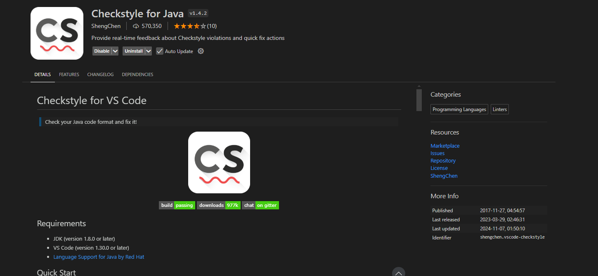
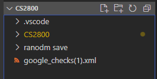
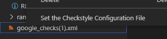
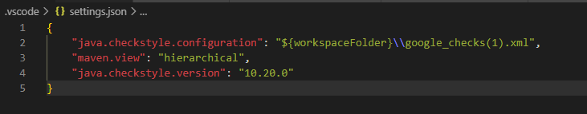
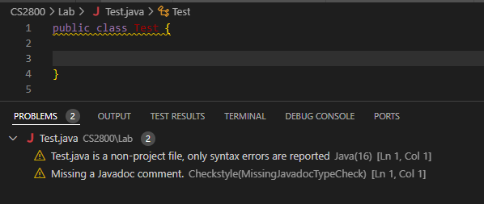

# How to setup checkstyle in VSCode

## Download the checkstyle extension

## Download the google checkstyle file and add it to the repo

## Set as the config

## Settings should look like this

## Check it works by seeing if you have javadoc violations
